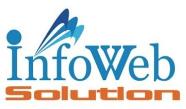

# Wonderlust_APIs

  | 

# 1.Introduction

1.1	Company Profile

 	“Info Web Solution” is an IT Firm. It specializes in projects that combine beautiful interactive design with intelligent technology. Here at Speed Limit, we understand that having a great web application software or website, a print piece, or even a beautiful logo is just not enough. You need results. 
 	“Info Web Solution” is a results-focused and driven shop. The Company love tying in creative marketing campaigns to our great work.

1.2	Customer Profile

 	Wanderlust Travel & Tours is a leading Outbound and Inbound tour operating company based in India. They take pride in maintaining the hospitable approach with our 20+ years of experience in the Travel Industry, which has led to many satisfied customers internationally until now. 
 	They are constantly improving and refining our services to meet your specific needs. With just one call or email to them or online.
 	Here, with the name of “Traveler” we will help find a suitable dream holiday for their customers and your family. By offer them a joyful, hassle free and cost-efficient experience with 100% transparency. And they will “Trust us with their journey to See the World.”

1.2.1	Current System

 	As per the current system of the client is mostly offline, so its required user to go physically at company and booking their trip
 	So, to overcome from this kind of many problems they are trying to be settle on digital platform as well.

# 2. Core Components

Core Components 
 	
    Setup: 
Setup component is only used by admin. In that component admin can manage packages, hotels, transportations, categories of packages, room types of hotels, blogs and can see the user related information like their confirm bookings, inquiries, feedbacks etc.
 	
    Packages: 
In this component register user can see list of packages and can search the dream destinations as per the provided criteria and can get the necessary details of that places, can give the feedbacks, can have booking of that and at that end they can pay the payments.
 	
    Hotels: 
In this component register user can see list of hotels and can search the place for the stay as per the provided criteria and can get the necessary details of that places, can give the feedbacks, can have booking of that and at that end they can pay the payments.
 	
    Transportations: 
In this component register user can see list of transportation and can search the dream destinations as per the provided criteria and can get the necessary details of that places, can give the feedbacks, can have booking of that and at that end they can pay the payments.
 	
    Home: 
In this component registered user can search the packages according to their criteria. Through the packages, the user can see the whole details of the place and according to their thought, they will provide the feedback (rating). Here there will be the latest and popular places and staying places and transportations list through which the register user

# Hardware Requirement 	

Processor of 800 MHz Pentium (R), 
Minimum 512 MB RAM and Above, 
Minimum 40 GB Hard Disk and Above,
Mouse, 
Keyboard.

# Software Specification 	

Front End Software:  Visual Studio 2022, VS Code 2022
Back End:            SQL SERVER 19
Operating System:    Windows 10 OR above

# Development Description

